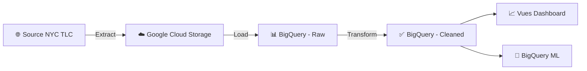
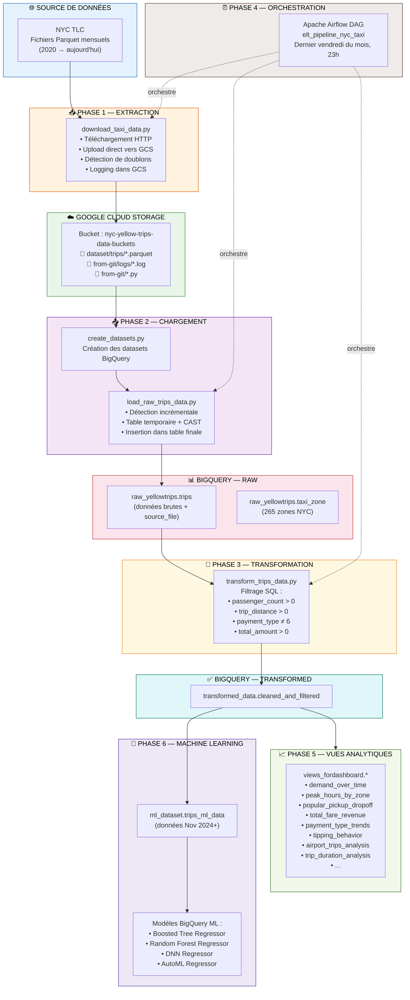
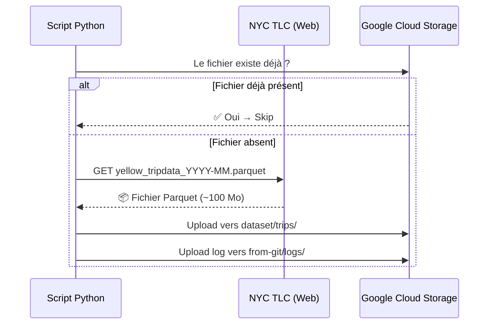
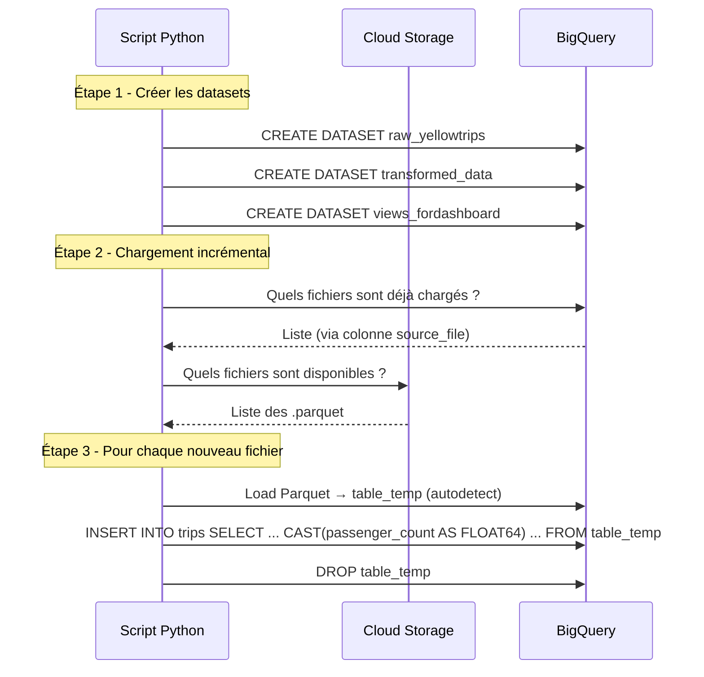
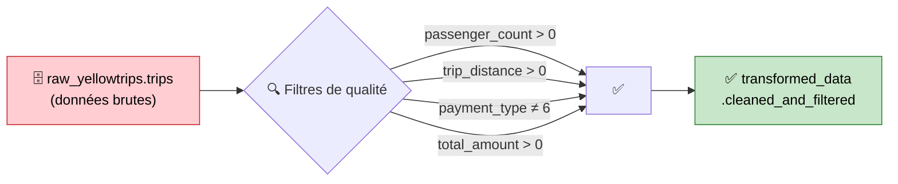
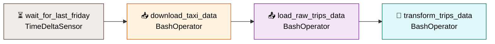
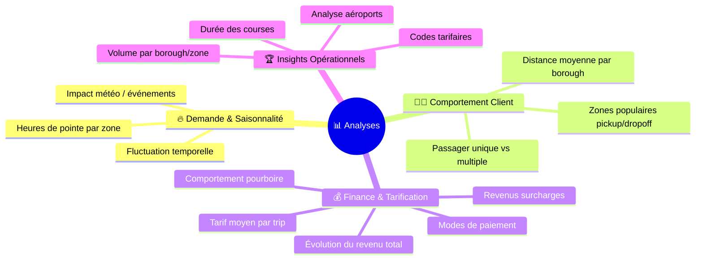
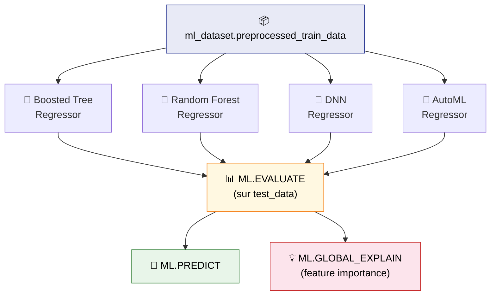

<p align="center">
  
  
  
  
  
  
</p>

<h1 align="center">🚕 NYC Yellow Taxi — Pipeline ELT sur GCP</h1>

<p align="center">
  <em>De l'ingestion des données brutes au Machine Learning — un projet Data Engineering de bout en bout sur Google Cloud Platform.</em>
</p>

<p align="center">
  
  
  
  
</p>

---

## 📋 Table des Matières

- [Contexte Business](#-contexte-business)
- [Problématique Technique](#-problématique-technique)
- [Architecture Globale](#-architecture-globale)
- [Stack Technologique](#-stack-technologique)
- [Phase 1 — Extraction (Extract)](#-phase-1--extraction-extract)
- [Phase 2 — Chargement (Load)](#-phase-2--chargement-load)
- [Phase 3 — Transformation (Transform)](#-phase-3--transformation-transform)
- [Phase 4 — Orchestration (Airflow)](#-phase-4--orchestration-airflow)
- [Phase 5 — Analyse & Dashboarding](#-phase-5--analyse--dashboarding)
- [Phase 6 — Machine Learning (BigQuery ML)](#-phase-6--machine-learning-bigquery-ml)
- [Structure du Projet](#-structure-du-projet)
- [Déploiement & Exécution](#-déploiement--exécution)

---

## 🏙️ Contexte Business

La **New York City Taxi & Limousine Commission (TLC)** régule l'industrie du transport par taxi à New York. Chaque mois, des millions de courses effectuées par les taxis jaunes (*Yellow Cabs*) sont enregistrées : point de départ, destination, tarif, pourboire, nombre de passagers, mode de paiement, etc.

**Pourquoi ce projet est-il important ?**

Ces données représentent une mine d'or pour les décideurs du secteur des transports urbains. Elles permettent de répondre à des questions concrètes :

| Question Business | Valeur Ajoutée |
|---|---|
| Quels sont les horaires et zones de forte demande ? | Optimiser le positionnement des flottes de taxis |
| Comment le revenu évolue-t-il dans le temps ? | Anticiper les tendances saisonnières et ajuster les tarifs |
| Quels facteurs influencent le montant des pourboires ? | Améliorer la qualité de service pour maximiser les revenus |
| Quels aéroports génèrent le plus de courses ? | Allouer les ressources aux points stratégiques |
| Peut-on prédire le montant total d'une course ? | Fournir des estimations fiables aux passagers |

> **En résumé** : Ce projet construit un pipeline de données complet (**ELT**) qui collecte, nettoie, transforme et analyse les données de courses de taxis jaunes de New York, de 2020 à aujourd'hui, afin de produire des insights exploitables et des modèles prédictifs.

---

## 🔧 Problématique Technique

Traiter les données de taxis jaunes de NYC pose plusieurs défis techniques concrets :

```
📊 Volume        → Plus de 300 millions de lignes (2020 — 2025)
📁 Format        → Fichiers Parquet distribués mensuellement (~60 fichiers)
🔄 Fréquence     → Nouvelles données publiées chaque mois par la NYC TLC
⚠️ Qualité       → Valeurs manquantes, courses invalides, types incohérents
☁️ Infrastructure → Besoin d'un environnement scalable et managé (Cloud)
```

**L'approche ELT** (Extract → Load → Transform) a été choisie plutôt qu'un ETL classique. Pourquoi ?

- Les données brutes sont **chargées directement** dans BigQuery *avant* d'être transformées
- BigQuery, en tant que moteur analytique distribué, est **plus performant** pour les transformations SQL à grande échelle que des scripts Python locaux
- Cela permet de **conserver les données brutes** (traçabilité) tout en créant des vues et tables transformées pour l'analyse



---

## 🏗️ Architecture Globale

Le schéma ci-dessous illustre l'architecture complète du projet, de la source de données jusqu'aux résultats finaux :



---

## 🛠️ Stack Technologique

| Catégorie | Outil | Rôle dans le projet |
|---|---|---|
| ☁️ **Cloud** |  | Infrastructure cloud (stockage, compute, ML) |
| 🗄️ **Stockage Objet** |  | Data lake — stockage des fichiers Parquet bruts et des logs |
| 📊 **Data Warehouse** |  | Entrepôt de données analytique, transformations SQL, ML intégré |
| 🐍 **Langage** |  | Scripts d'extraction, chargement, et orchestration |
| 🗃️ **Requêtes** |  | Transformations, création de vues, entraînement de modèles ML |
| ⏰ **Orchestration** |  | Planification et exécution automatisée du pipeline ELT |
| 🔥 **Big Data** |  | Analyse exploratoire sur fichiers Parquet volumineux |
| 📁 **Format** |  | Format columnar optimisé pour l'analytique |
| 🤖 **ML** |  | Entraînement et évaluation de modèles directement en SQL |

---

## 📥 Phase 1 — Extraction (Extract)

> **Objectif** : Télécharger les fichiers Parquet depuis le site de la NYC TLC et les stocker dans Google Cloud Storage.

**Script** : `download_taxi_data.py`



### Étape 1 — Configuration

Le script définit les constantes du projet GCP : identifiant du projet, nom du bucket, et les chemins de stockage dans GCS.

```python
PROJECT_ID = "nyc-yellow-trips"
BUCKET_NAME = f"{PROJECT_ID}-data-buckets"
GCS_FOLDER = "dataset/trips/"
```

### Étape 2 — Vérification des doublons

Avant chaque téléchargement, le script vérifie si le fichier existe déjà dans GCS grâce à la méthode `blob.exists()`. Cela évite de re-télécharger des données déjà présentes et rend le processus **idempotent** (on peut le relancer sans risque de duplication).

### Étape 3 — Téléchargement & Upload

Pour chaque mois de 2020 à aujourd'hui, le script :
1. Construit l'URL du fichier Parquet sur le CDN de la NYC TLC
2. Effectue une requête HTTP `GET` avec streaming
3. Upload le contenu directement vers le bucket GCS (sans écriture locale sur disque)

### Étape 4 — Logging centralisé

Toutes les opérations sont tracées dans un fichier log uploadé dans GCS (`from-git/logs/`), ce qui permet un audit complet de chaque exécution.

---

## 📤 Phase 2 — Chargement (Load)

> **Objectif** : Charger les fichiers Parquet depuis GCS vers BigQuery, en gérant les incohérences de schéma.

**Scripts** : `create_datasets.py` + `load_raw_trips_data.py`



### Étape 1 — Création des Datasets BigQuery

Le script `create_datasets.py` initialise **3 datasets** dans BigQuery :

| Dataset | Rôle |
|---|---|
| `raw_yellowtrips` | Données brutes (table `trips` + table `taxi_zone`) |
| `transformed_data` | Données nettoyées et filtrées |
| `views_fordashboard` | Vues SQL pour les dashboards |

Le script vérifie l'existence de chaque dataset avant de le créer, ce qui le rend **idempotent**.

### Étape 2 — Détection incrémentale

Le script `load_raw_trips_data.py` compare :
- La liste des fichiers **déjà chargés** (via la colonne `source_file` dans BigQuery)
- La liste des fichiers **disponibles** dans le bucket GCS

Seuls les **nouveaux fichiers** sont traités. C'est ce qu'on appelle un **chargement incrémental** : à chaque exécution, seules les données fraîches sont ajoutées.

### Étape 3 — Chargement avec gestion de schéma

Certains fichiers Parquet ont des types de colonnes différents (par exemple, `passenger_count` peut être `INT64` dans un fichier et `FLOAT64` dans un autre). Pour gérer cela :

1. Le fichier est d'abord chargé dans une **table temporaire** avec `autodetect=True`
2. Un `INSERT INTO ... SELECT ... CAST(...)` harmonise les types avant l'insertion finale
3. La table temporaire est supprimée après usage

Ce pattern **table temporaire → transformation → insertion** est une pratique courante en Data Engineering pour gérer les schémas hétérogènes.

---

## 🔄 Phase 3 — Transformation (Transform)

> **Objectif** : Nettoyer les données brutes en appliquant des filtres de qualité pour produire un dataset fiable.

**Script** : `transform_trips_data.py`



### Règles de filtrage appliquées

Le script exécute une requête SQL `CREATE OR REPLACE TABLE` qui applique 4 filtres :

| Filtre | Raison | Données exclues |
|---|---|---|
| `passenger_count > 0` | Une course sans passager est une anomalie | Courses fantômes / erreurs de capteur |
| `trip_distance > 0` | Une distance nulle indique un enregistrement invalide | Courses annulées non nettoyées |
| `payment_type ≠ 6` | Le type 6 = "Voided trip" (course annulée) | Courses officiellement annulées |
| `total_amount > 0` | Un montant négatif ou nul est incohérent | Erreurs de facturation / remboursements |

> 💡 **Pourquoi transformer dans BigQuery ?** Plutôt que de nettoyer en Python (ce qui nécessiterait de charger toutes les données en mémoire), la transformation est effectuée **directement en SQL dans BigQuery**. Le moteur distribué de BigQuery traite des centaines de millions de lignes en quelques secondes — c'est l'avantage principal du pattern **ELT** par rapport à l'ETL classique.

---

## ⏰ Phase 4 — Orchestration (Airflow)

> **Objectif** : Automatiser l'exécution séquentielle du pipeline ELT à intervalle régulier.

**Script** : `elt_dag_pipeline.py`



### Configuration du DAG

| Paramètre | Valeur | Explication |
|---|---|---|
| **Schedule** | `0 23 * * 5` | Chaque vendredi à 23h |
| **Condition** | Dernier vendredi du mois | Aligné sur le calendrier de publication NYC TLC |
| **Retries** | 2 tentatives | Résilience face aux erreurs réseau |
| **Retry delay** | 5 minutes | Temps d'attente entre chaque tentative |
| **Catchup** | `False` | N'exécute pas les runs passés manqués |

### Fonctionnement des tâches

Chaque tâche `BashOperator` :
1. **Récupère le script Python** depuis GCS (`gsutil cp`)
2. **Exécute le script** (`python3`)

Les scripts sont stockés dans GCS (`from-git/`) plutôt qu'en local sur la VM Airflow, ce qui facilite les mises à jour sans redéploiement.

### Chaîne de dépendances

```
wait_for_last_friday >> download_taxi_data >> load_raw_trips_data >> transform_trips_data
```

L'opérateur `>>` d'Airflow garantit que chaque tâche ne démarre qu'après le succès de la précédente. Si l'extraction échoue, le chargement n'est jamais déclenché.

---

## 📈 Phase 5 — Analyse & Dashboarding

> **Objectif** : Créer des vues SQL analytiques exploitables par un outil de visualisation (Looker Studio, Streamlit, etc.).

**Scripts** : `MarketDemand_and_CustomerBehavior.sql`, `Financial_and_Pricing.sql`, `CompetitiveInsights.sql`

Les analyses sont organisées en **4 axes stratégiques**, chacun répondant à des questions business précises :



### Vues créées dans `views_fordashboard`

| # | Vue | Question Business |
|---|---|---|
| 1 | `demand_over_time` | Comment la demande fluctue-t-elle (jour, semaine, mois, saison) ? |
| 2 | `peak_hours_by_zone` | Quelles sont les heures de pointe par borough et zone ? |
| 3 | `popular_pickup_dropoff` | Quels sont les lieux de prise en charge et de dépose les plus populaires ? |
| 4 | `avg_trip_distance_analysis` | Quelle est la distance moyenne par borough, heure et saison ? |
| 5 | `passenger_trends_by_season` | Passager unique vs multiples : y a-t-il une saisonnalité ? |
| 6 | `total_fare_revenue_over_time` | Comment le revenu total évolue-t-il dans le temps ? |
| 7 | `avg_fare_analysis` | Quel est le tarif moyen par trip, borough et heure ? |
| 8 | `payment_type_trends` | Quelle proportion carte vs cash, et comment évolue-t-elle ? |
| 9 | `tipping_behavior_analysis` | Quels facteurs influencent les pourboires ? |
| 10 | `additional_charges_revenue` | Combien rapportent les surcharges (MTA, congestion, aéroport) ? |
| 11 | `trip_volume_by_borough` | Quels boroughs ont le plus/moins de courses ? |
| 12 | `airport_trips_analysis` | Fréquence et tarif moyen des courses aéroport (JFK, LGA, EWR) ? |
| 13 | `rate_code_analysis` | Distribution des codes tarifaires par borough ? |
| 14 | `trip_duration_analysis` | Durée moyenne des courses et tendance dans le temps ? |

> 💡 Les vues BigQuery sont **virtuelles** : elles ne stockent pas de données mais exécutent la requête à la demande. Cela évite la duplication tout en offrant des résultats toujours à jour.

---

## 🤖 Phase 6 — Machine Learning (BigQuery ML)

> **Objectif** : Prédire le montant total d'une course (`total_amount`) à l'aide de modèles ML entraînés directement dans BigQuery.

**Scripts** : `create_ml_dataset_table.py` + `modeling_queries.sql`

### Étape 1 — Préparation du dataset ML

Le script `create_ml_dataset_table.py` crée une table dédiée au ML en filtrant les données récentes (à partir de novembre 2024) et en ne conservant que les paiements par carte ou cash (`payment_type IN (1, 2)`).

### Étape 2 — Entraînement des modèles

Quatre modèles sont entraînés et comparés, tous avec `total_amount` comme variable cible :



| Modèle | Type | Caractéristique |
|---|---|---|
| **Boosted Tree Regressor** | Gradient Boosting | Performant sur données tabulaires, rapide à entraîner |
| **Random Forest Regressor** | Ensemble de décision | Robuste aux outliers, bonne généralisation |
| **DNN Regressor** | Réseau de neurones profond | Capture des relations non-linéaires complexes |
| **AutoML Regressor** | Sélection automatique | Google choisit et optimise le meilleur algorithme |

### Étape 3 — Évaluation & Interprétabilité

- **`ML.EVALUATE`** : Calcule les métriques de performance (MAE, RMSE, R²) sur le jeu de test
- **`ML.PREDICT`** : Génère des prédictions sur de nouvelles données
- **`ML.GLOBAL_EXPLAIN`** : Identifie les variables les plus influentes (feature importance)

> 💡 **Avantage BigQuery ML** : Pas besoin de configurer un environnement Python séparé (TensorFlow, scikit-learn). L'entraînement, l'évaluation et les prédictions se font **entièrement en SQL**, directement sur les données stockées dans BigQuery.

---

## 📂 Structure du Projet

```
📦 taxitripapp/
│
├── 📥 EXTRACTION
│   └── download_taxi_data.py          # Téléchargement NYC TLC → GCS
│
├── 📤 CHARGEMENT
│   ├── create_datasets.py             # Initialisation des datasets BigQuery
│   └── load_raw_trips_data.py         # Chargement incrémental GCS → BigQuery
│
├── 🔄 TRANSFORMATION
│   └── transform_trips_data.py        # Nettoyage et filtrage des données
│
├── ⏰ ORCHESTRATION
│   └── elt_dag_pipeline.py            # DAG Airflow (planification mensuelle)
│
├── 📈 ANALYSE
│   ├── exploratory_data_analysis.py   # EDA avec PySpark
│   ├── MarketDemand_and_CustomerBehavior.sql
│   ├── Financial_and_Pricing.sql
│   └── CompetitiveInsights.sql
│
├── 🤖 MACHINE LEARNING
│   ├── create_ml_dataset_table.py     # Préparation du dataset ML
│   ├── modeling_queries.sql           # Entraînement / évaluation BigQuery ML
│   ├── Custom_Model.ipynb             # Modèle personnalisé (notebook)
│   └── Report_2/3/4.ipynb             # Rapports d'analyse
│
├── 📋 RÉFÉRENCE
│   ├── taxi_zone_lookup.csv           # Mapping des 265 zones NYC
│   └── README.md                      # Ce fichier
```

---

## 🚀 Déploiement & Exécution

### Prérequis

```bash
# 1. Avoir un projet GCP actif avec la facturation activée
gcloud projects list

# 2. Activer les APIs nécessaires
gcloud services enable bigquery.googleapis.com
gcloud services enable storage.googleapis.com
gcloud services enable composer.googleapis.com  # Pour Airflow managé

# 3. Installer les dépendances Python
pip install google-cloud-bigquery google-cloud-storage requests pyarrow pyspark
```

### Exécution manuelle (étape par étape)

```bash
# Phase 1 — Extraction
python download_taxi_data.py

# Phase 2 — Chargement
python create_datasets.py
python load_raw_trips_data.py

# Phase 3 — Transformation
python transform_trips_data.py

# Phase 4 — ML (optionnel)
python create_ml_dataset_table.py
# Puis exécuter modeling_queries.sql dans la console BigQuery
```

### Exécution automatisée (Airflow)

Déployer le fichier `elt_dag_pipeline.py` dans le dossier `dags/` de votre instance Cloud Composer. Le pipeline s'exécutera automatiquement le dernier vendredi de chaque mois à 23h.

---

## 📊 Données de Référence

Le fichier `taxi_zone_lookup.csv` contient le mapping des **265 zones de taxi** de New York :

| Colonne | Description |
|---|---|
| `LocationID` | Identifiant unique de la zone (1–265) |
| `Borough` | Arrondissement (Manhattan, Brooklyn, Queens, Bronx, Staten Island, EWR) |
| `Zone` | Nom de la zone (ex: "JFK Airport", "Times Sq/Theatre District") |
| `service_zone` | Type de zone de service (Yellow Zone, Boro Zone, Airports) |

---

<p align="center">
  
</p>

<p align="center">
  <em>Projet réalisé par <strong>Josué Afouda</strong> — Pipeline ELT de bout en bout sur GCP</em>
</p>
